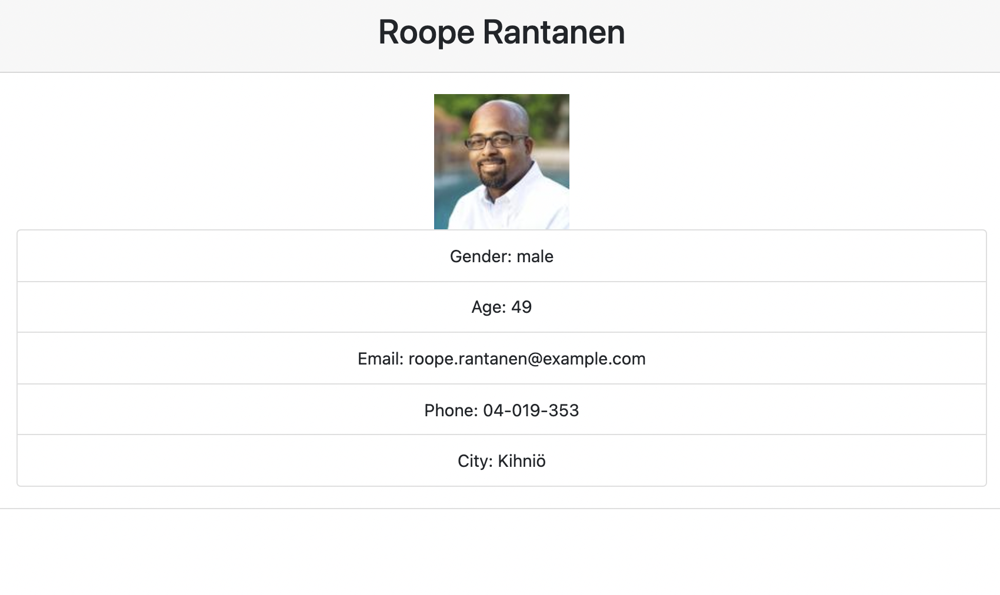

# employeeDirectory

License for this app is : MIT

# Table of Contents

- [Description](#description)
- [License](#license)
- [Questions](#questions)
- [App-Link](#app-link)
- [Demo](#demo)

## Description:
    This is a React app that runders random list of employees using a web API

## License:
    For information about the license, click the link below.

- [License](https://opensource.org/license/random)

## Questions:
    Contact me at the following Link:

- [GitHub Profile](https://github.com/omartdh)

    Send me an email at: omartdh@gmail.com

## App-Link:

- [app link](https://omartdh.github.io/employeeDirectory/)

## Demo:

